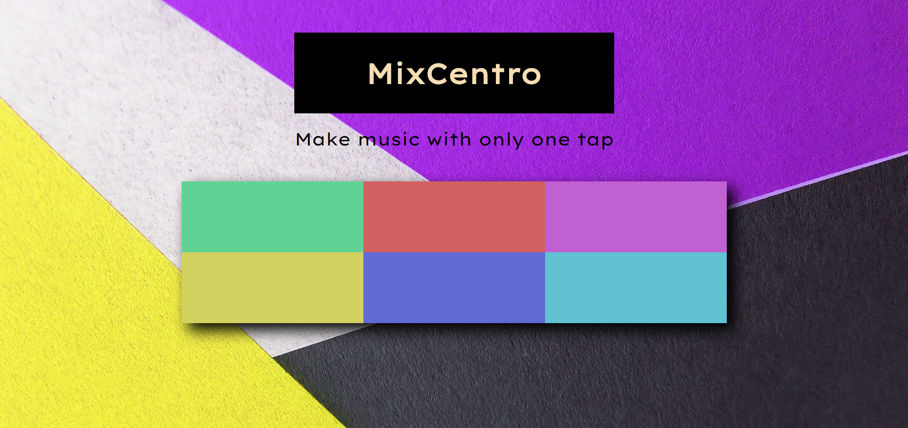
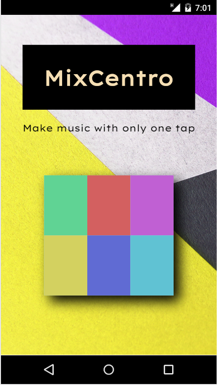
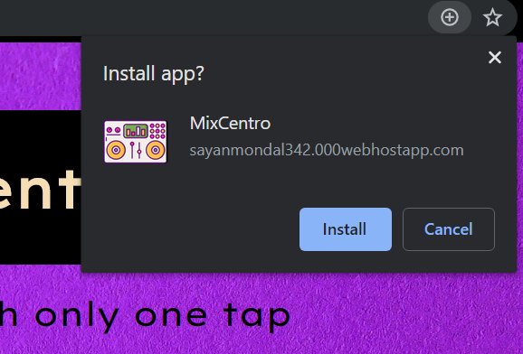

# MixCentro

A Progressive Web App which let's you play with different music and create your own by mixing them.
### 👉 If you like this repo then please give it a ⭐️

## Short Description
This is a simple Progressive Web App which can simulate a musical environment and users can interact with this app to play different music and mix them up to create some of their own. This application is made for entertainment purposes only.

## Screenshots
 
      
      
     
## NOTE:
This project is subject to change by the developer and is still in development

## How to run this
Running this is as simple as it gets. Follow this steps
1. Open your terminal (NOTE: git bash prefered/ Terminal on VS Code)
2. Navigate to the project folder where you have cloned this repo.
3. Type the following command in the terminal 
     ```
     yarn start
     ```
     
## Pull Request

Pull Requests are welcome. Please follow these rules for the ease of understanding:
* Make sure to check for available issues before raising one
* Give me a maximum of 24-48 hours to respond
* Have proper documentation on the parts you are changing/adding

#### Feel free to contribute

Licensed under the Apache License, Version 2.0 (the "License");
you may not use this file except in compliance with the License.
You may obtain a copy of the License at

    http://www.apache.org/licenses/LICENSE-2.0

Unless required by applicable law or agreed to in writing, software
distributed under the License is distributed on an "AS IS" BASIS,
WITHOUT WARRANTIES OR CONDITIONS OF ANY KIND, either express or implied.
See the License for the specific language governing permissions and
limitations under the License.
```

## Getting Started
For help getting started with PWA, [Check this out](https://developers.google.com/web/progressive-web-apps/).
